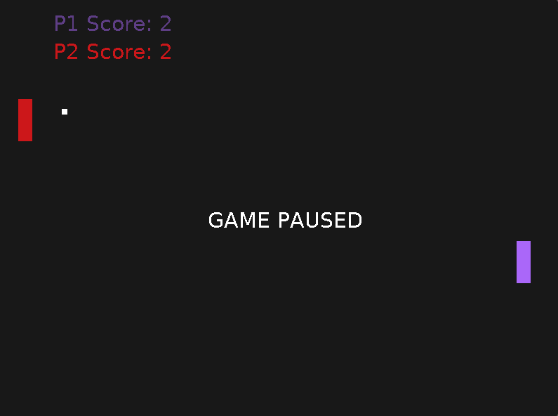

# Pong



GUI Pong game in Zig, using SDL2

## Quick Start

Requirements:

- Zig v0.11.0
- SDL2 and SDL_ttf

```console
$ zig build run
```

> I've only tested this on linux, though I do intend to add cross-compile support for Mac and Windows soon
