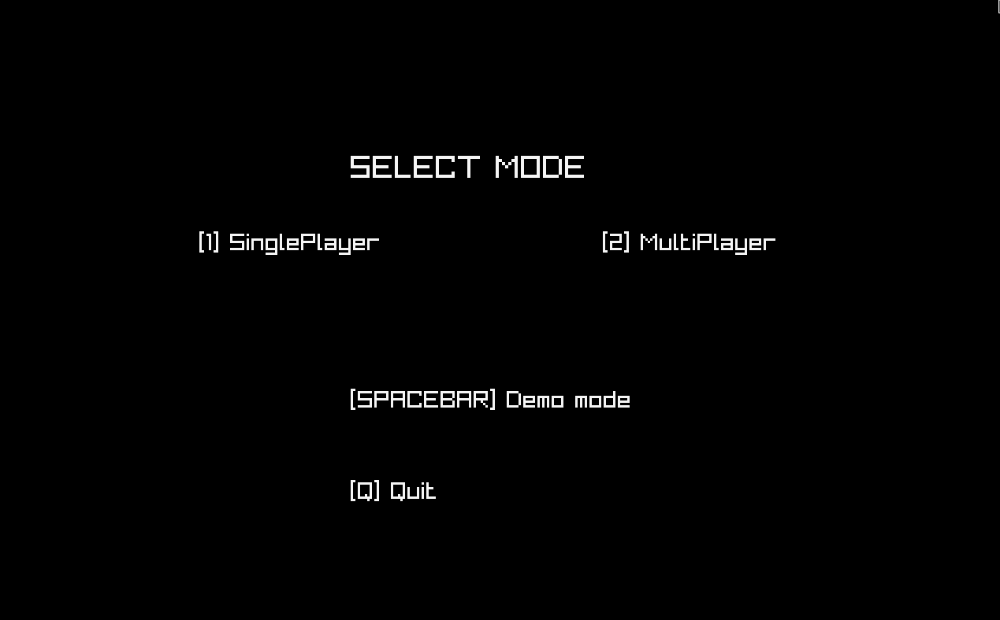
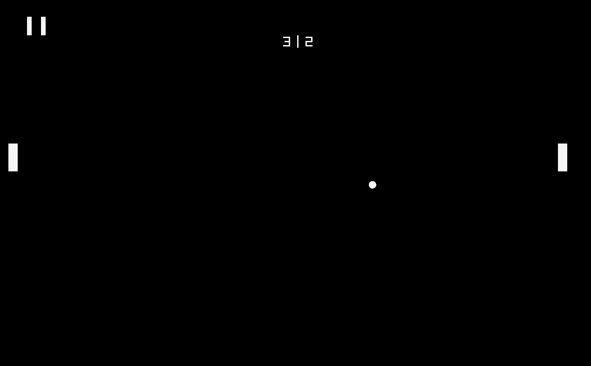
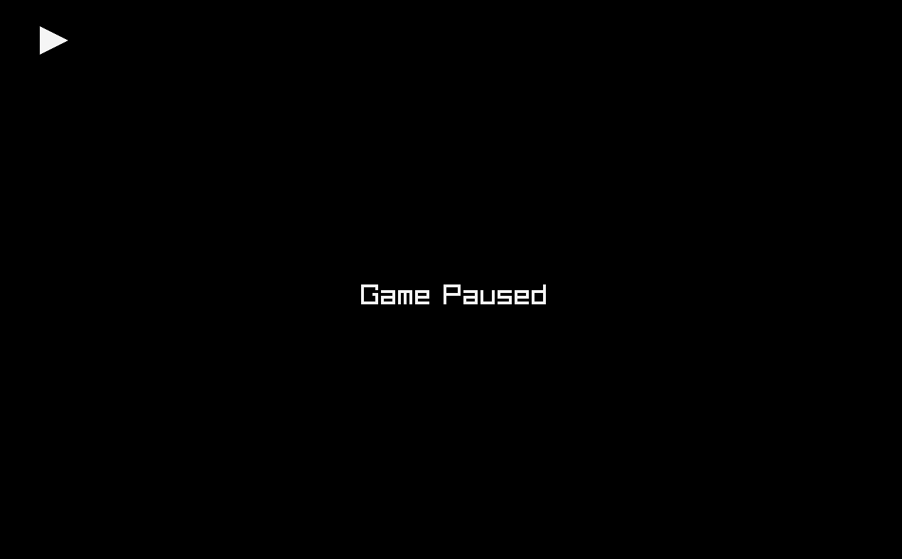

# Pong



GUI Pong game in Zig, using Raylib (Re-written from SDL2)

## Quick Start

### Building From Source

Requirements:

- Zig v0.11.0

```console
$ zig build run
```

### Binary Download

I have a release available with a windows binary

Linux users, feel free to try to run this with WINE

## How To Play

Pong. Hit ball, don't let ball go past your paddle.

Multiplayer Mode: 
Left Player Uses W and S to move.
Right Player uses Up and Down arrows to move.

Sound Effects are taken from Raylib's examples/audio/resources directory

## Screenshots




